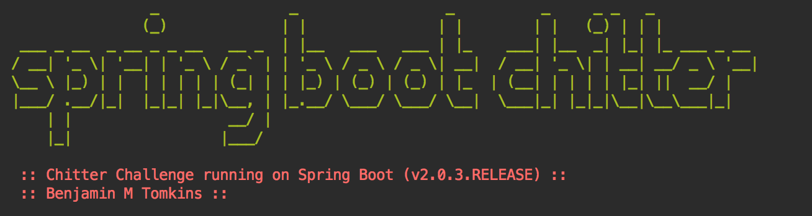

**This project has been created from scratch without the aid of another project for reference**

**Current status : working on the APIs before tackling the user cases**

#### Features :

```
STRAIGHT UP

As a Maker
So that I can let people know what I am doing  
I want to post a message (peep) to chitter

As a maker
So that I can see what others are saying  
I want to see all peeps in reverse chronological order

As a Maker
So that I can better appreciate the context of a peep
I want to see the time at which it was made

As a Maker
So that I can post messages on Chitter as me
I want to sign up for Chitter

HARDER

As a Maker
So that only I can post messages on Chitter as me
I want to log in to Chitter

As a Maker
So that I can avoid others posting messages on Chitter as me
I want to log out of Chitter

ADVANCED

As a Maker
So that I can stay constantly tapped in to the shouty box of Chitter
I want to receive an email if I am tagged in a Peep
```

#### Tech Notes :

##### RESTful Web Services model guideline and end points for this project

Social Media Application

User -> Posts .. (one-to-many relationship)

  |     Task      | HTTP-method | URI |
  | --- | --- | --- |
  | Retrieve all Users    |   GET    |  /users |
  | Create a Users        |   POST   |  /users |
  | Retrieve one User     |   GET    |  /users/{id} -> /users/1 |
  | Delete a User         |   DELETE | /users/{id} -> /users/1 |
  | Retrieve all posts for a User |   GET  |   /users/{id}/posts |
  | Create a post for a User      |   POST |   /users/{id}/posts |
  | Retrieve details of a posts   |   GET  |   /users/{id}/posts/{post_id} |

```Hibernate: drop table user if exists```

```Hibernate: drop sequence if exists hibernate_sequence```

```Hibernate: create table user (
id integer not null, 
birth_date timestamp, 
name varchar(255), 
primary key (id))```

```localhost:3000/h2-console
jdbc:h2:mem:testdb
```

```
Following are the annotations used by the controllers:

@RestController - this annotation will treat class as controller that defines the @Controller and @ResponseBody annotations
@RequestMapping - used the map web request onto specific methods
@GetMapping - specialized version of @RequestMapping annotation that method handle the HTTP GET request with given URI
@PostMapping - same as @GetMapping but handle the HTTP POST method
@PutMapping - same as @GetMapping but handle the HTTP PUT method
@DeleteMapping - same as @GetMapping but handle the HTTP DELETE method
@PathVariable - obtain a parameter to a web request, in our example movie or review ID
@RequestBody - this annotation represents the body of the request, in our example, we map the body of the request to a movie and review data model class
```